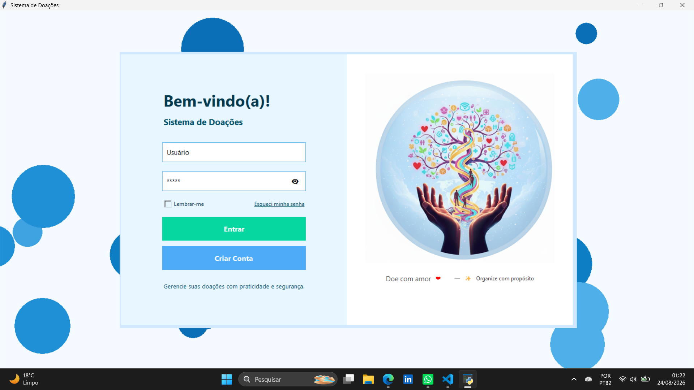
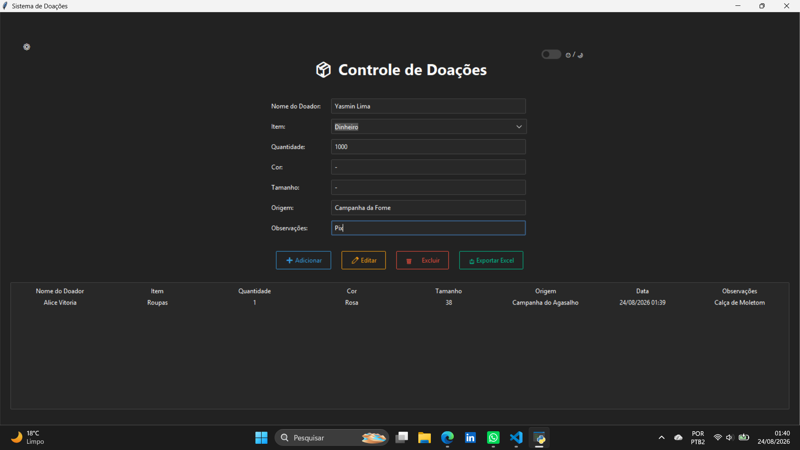
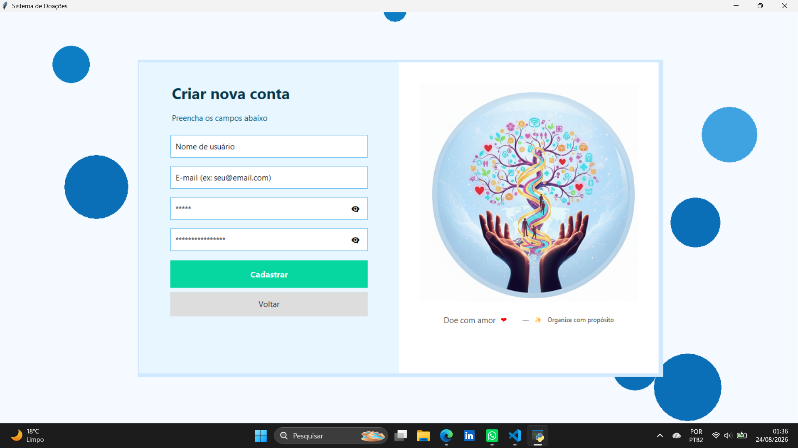

# 📦 Sistema de Controle de Doações

Sistema desktop desenvolvido em Python para gerenciamento e organização de doações.

## 🎯 Sobre o projeto

O Sistema de Controle de Doações é uma aplicação desktop desenvolvida em Python com o objetivo de facilitar o cadastro, organização, consulta e gerenciamento de doações.

O projeto foi desenvolvido aplicando conceitos de desenvolvimento de software, criação de interfaces gráficas, autenticação de usuários, persistência de dados e manipulação de arquivos.

## ✨ Funcionalidades

- 🔐 Sistema de login
- 👤 Autenticação de usuários
- 📦 Cadastro de doações
- 🔎 Consulta e pesquisa de registros
- ✏️ Edição de informações
- 🗑️ Exclusão de registros
- 💾 Persistência de dados utilizando SQLite
- 📊 Exportação de informações para Excel
- 🎨 Interface gráfica
- 🌓 Alternância de tema
- 🔒 Armazenamento de senhas utilizando bcrypt

## 🖥️ Demonstração

### 🔐 Tela de Login



### 📝 Cadastro de Doação



### 👤 Cadastro/Login



## 🛠️ Tecnologias utilizadas

| Tecnologia | Utilização |
|---|---|
| 🐍 Python | Linguagem principal |
| 🎨 Tkinter | Interface gráfica |
| 🎨 ttkbootstrap | Estilização da interface |
| 🔐 bcrypt | Hash de senhas |
| 🗄️ SQLite | Banco de dados |
| 📊 OpenPyXL | Exportação para Excel |
| 🔧 Git | Controle de versão |
| 🌐 GitHub | Hospedagem e versionamento do projeto |

## 📁 Estrutura do projeto

```text
sistema-controle-doacoes/
│
├── main.py                  # Inicialização da aplicação
├── interface.py             # Interface principal
├── banco_dados.py           # Operações relacionadas ao banco de dados
├── login.py                 # Sistema de autenticação
├── migrar_schema.py         # Migração/atualização do banco
│
├── config.json              # Configurações do sistema
├── config.txt               # Configuração de tema
├── login_ilustracao.png     # Ilustração da tela de login
│
├── requirements.txt         # Dependências do projeto
├── .gitignore               # Arquivos ignorados pelo Git
├── screenshots/             # Capturas de tela da aplicação
└── README.md                # Documentação do projeto

## ⚙️ Como executar

### Pré-requisitos

Antes de executar o projeto, certifique-se de ter instalado:

- Python 3
- Git

### 1. Clone o repositório

```bash
git clone https://github.com/alicevitoria28/sistema-controle-doacoes.git

### 2. Acesse a pasta do projeto
cd sistema-controle-doacoes
### 3. Crie um ambiente virtual

No Windows:

py -m venv .venv

### 4. Ative o ambiente virtual

No Windows PowerShell:

.venv\Scripts\activate

Após a ativação, o terminal deverá apresentar (.venv) no início da linha.

### 5. Instale as dependências
pip install -r requirements.txt

As principais dependências utilizadas pelo projeto são:

ttkbootstrap
bcrypt
openpyxl

### 6. Execute a aplicação
py main.py

### 💾 Banco de dados

A aplicação utiliza SQLite para armazenamento local das informações relacionadas às doações.

Os arquivos de banco de dados são ignorados pelo Git por meio do arquivo .gitignore, evitando que bancos de dados locais sejam enviados para o repositório.

### 🔐 Segurança

O projeto utiliza a biblioteca bcrypt para realizar o hash das senhas dos usuários.

Dessa forma, as senhas não precisam ser armazenadas diretamente em texto puro no sistema.

### 📊 Exportação de dados

O sistema possui funcionalidade de exportação de informações para arquivos Excel.

Para essa funcionalidade, é utilizada a biblioteca OpenPyXL.

### 🎨 Interface

A aplicação possui uma interface gráfica desenvolvida em Python utilizando Tkinter e ttkbootstrap.

O projeto também possui suporte à alteração do tema da interface, permitindo uma experiência visual personalizada.

### 🎓 Objetivos de aprendizado

Este projeto foi desenvolvido com o objetivo de colocar em prática conhecimentos relacionados a:

- Programação em Python
- Desenvolvimento de aplicações desktop
- Criação de interfaces gráficas
- Organização de código
- Banco de dados SQLite
- Autenticação de usuários
- Hash de senhas
- Manipulação de arquivos
- Exportação de dados
- Gerenciamento de dependências
- Controle de versão com Git
- Utilização do GitHub

### 🚧 Próximas melhorias

Algumas melhorias que podem ser implementadas futuramente:

- Implementação de testes automatizados
- Melhorias na validação dos dados
- Sistema de diferentes níveis de acesso
- Relatórios mais completos
- Melhorias na experiência do usuário
- Aprimoramento da interface
- Documentação técnica mais detalhada
- Ampliação das funcionalidades de gerenciamento

### 👩‍💻 Desenvolvedora

Alice Vitória

Estudante de Sistemas de Informação, com interesse em desenvolvimento de software, programação e tecnologia.

Este projeto faz parte da minha jornada de aprendizado e desenvolvimento na área de tecnologia.

⭐ Se você gostou do projeto, considere deixar uma estrela no repositório!